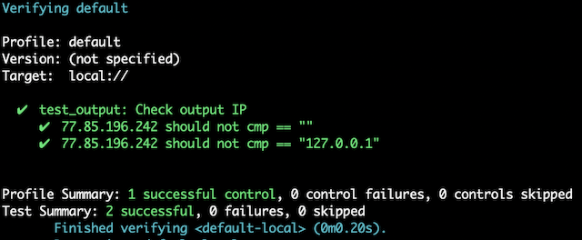

# Terraform custom plugin

A simple terraform project to show the use of a custom built plugin. The project includes also a Vagrant configuration to create a Linux machine with Go installed in order to build and use the plugin.

## Build the Vagrant machine

### Prerequisites

* Install VirtualBox - [instructions](https://www.virtualbox.org/wiki/Downloads)
* Install Vagrant - [instructions](https://www.vagrantup.com/downloads.html)

### Run Vagrant

* Build the VM - run `vagrant up`
* Login to the VM - run `vagrant ssh`

## Compile the plugin

The project already includes a compiled binary for Linux amd64 but if you want to build it from source follow these steps:

* Download the source code - `go get github.com/petems/terraform-provider-extip`
* Go to the project directory - `cd $GOPATH/src/github.com/petems/terraform-provider-extip`
* Compile the project - `make build`
* Copy the compiled binary - `cp $GOPATH/bin/terraform-provider-extip /vagrant/terraform.d/plugins/linux_amd64/.`

## Run Terraform

* If logged on the Vagrant machine change to the shared folder - `cd /vagrant`
* Run `terraform init`
* Run `terraform apply`

## Running Kitchen-CI tests

The instructions bellow assume that you are using the included Vagrant project which has the Kitchen-CI prerequisites installed.

* Go to the shared folder - `cd /vagrant`
* Install the Ruby gems from the Gemfile with bundler - `bundle install`
* Build kitchen environment - `bundle exec kitchen converge`
* Run kitchen tests - `bundle exec kitchen verify`
* Destroy kitchen environment - `bundle exec kitchen destroy`
* Automatically build, test, destroy - `bundle exec kitchen test`

A successful kitchen test should look like:

